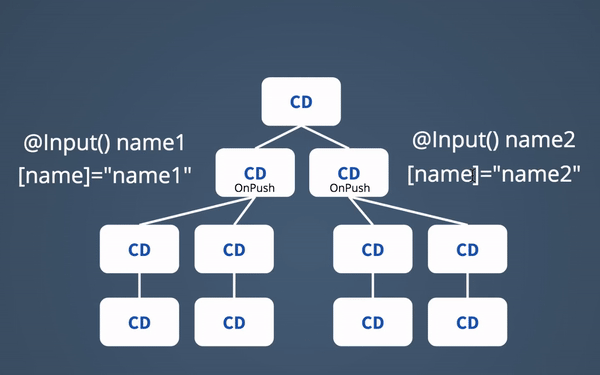

### Angular 2 performance pitfalls

---
@snap[west span-100]
ChangeDetectionStrategy OnPush - change detection mechanism
@snapend
@snap[west span-50]
Change detection mechanism
@snapend
@snap[east span-50]

@snapend
---
#### OnPush - problems with third party libs 
@ul[list-spaced-bullets]
- its risky to use OnPush on Component with many childrens
- you must to get back to Angular Zone when using libraries from outside angular ecosystem
@ulend
---
#### OnPush - problem with subscription to shared state

@ul[list-spaced-bullets]
- use | async pipes
- use changeDetectionRef.markForCheck
@ulend
---

#### NgZone - Move frequent events, that are not changing angular state outside ngZone
@ul[list-spaced-bullets]
- do not listen to scroll, mouse and other haevy events inside angular unless its necessary
- do not attach listeneres to global evenets like domcument.click or xhr.onReadyStateChange
- some third party libraries like analytics SDKs, hotjar, jquer plugis can hurt your performance
@ulend
---

#### TrackBy *NgFor
use it whenever you are using immutables. NgFor compares list items by reference. If refernce changes it recreates entire item from scratch.
---

#### use ShareReplay(1) and DistinctUntilChanged() with observables
@ul[list-spaced-bullets]
- always use shareReplay(1) on streams you wanna make public and expect to have many subscribers
- to prevent view model computation when unecessary select from golbal state only dependant properties and add distinctUntiChanged(isEqual)
@ulend
---

#### avoid binding to methods or getters
@ul[list-spaced-bullets]
- caclulate your viewmodel only when necessary 
- use memoize from lodash
- recalc model when dependand inputs changed inside ngOnChanges method
- using methods or getters for binding causes recalculation every changedetection cycle
- methods or getters returns always new instance which causes children with onPush to rerender 
@ulend
---

#### play with this cool change detection demo

https://danielwiehl.github.io/edu-angular-change-detection
@fa[external-link]](https://danielwiehl.github.io/edu-angular-change-detection/)